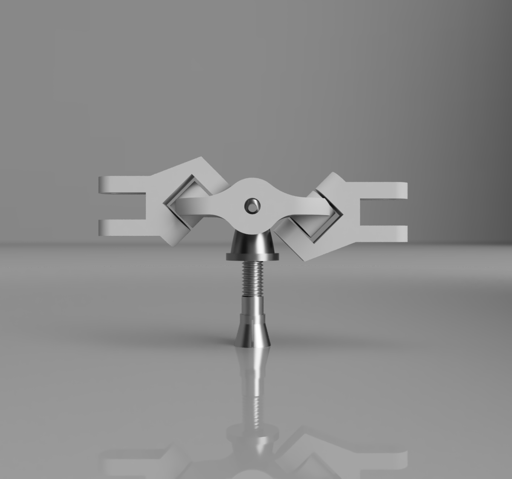
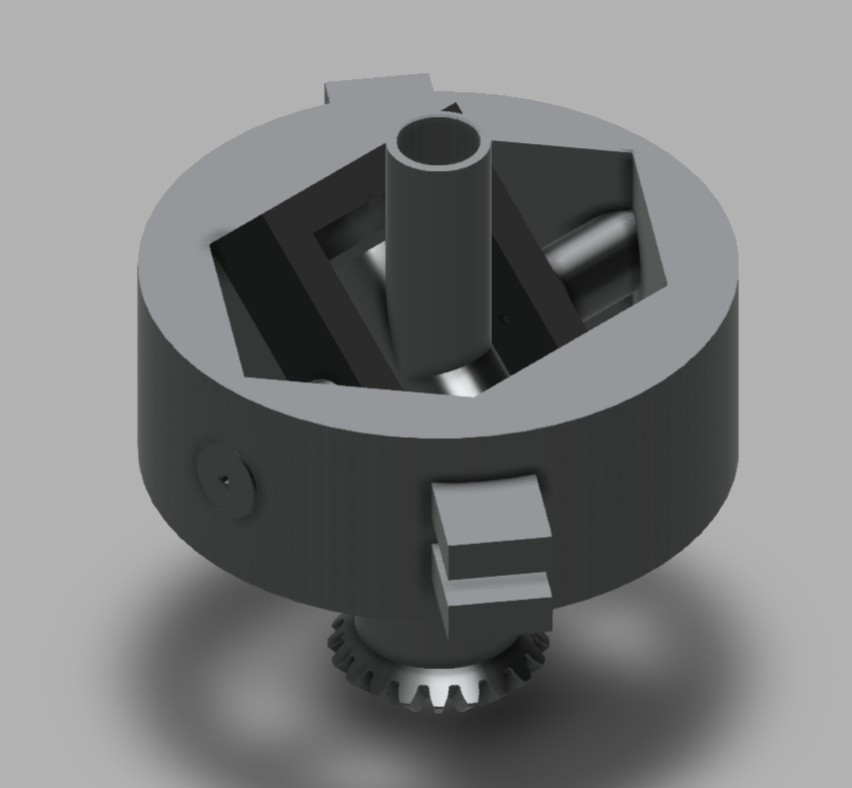
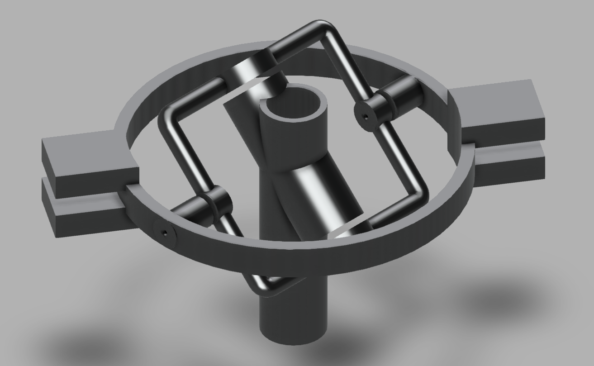

# Underactuatuated Rotor

Project for controlling a bldc motor with a ps4 controller, fulfilling the underactuated rotor mechanism.

# How to run

0. Load underactuated-arduino-uno.io onto device.
1. Start sending commands from ps4 controller to remote: python3 remoteCommand.py
2. Start graphing: bokeh serve --show graphServer.py 
3. Starting the Arduino Uno command server python3 commandServer.py

# [Circuit](https://github.com/kaepek/sbldc-smt)

# Models

## Minimal v1

- [V1 model link](./models/Minimal-Rotor-v24.f3z)

## Hex Design v2

- [V2 model link](./models/underactuated-rotor-hex-design-v31.f3d)

## Hex Design v3

- [V3 model link](./models/underactuated-rotor-new-v3-params-v5.f3d)

# Draft notes on models:

[Notes](./resources/notes.pdf)

# Credits:

- [Modlab UPenn](https://www.modlabupenn.org/underactuated-rotor/)
- [Paper](https://www.modlabupenn.org/wp-content/uploads/paulos_an_underactuated_propeller_IROS_2013.pdf)
- Steve Kelsey (Minimal rotor design)

# License

Work is licensed under a
Creative Commons Attribution-NonCommercial 4.0 International License.

You should have received a copy of the license along with this
work. If not, see <https://creativecommons.org/licenses/by-nc/4.0/> or [plain text license](https://creativecommons.org/licenses/by-nc/4.0/legalcode.txt)

Released under fair use for educational purposes, strictly not for commercial use.